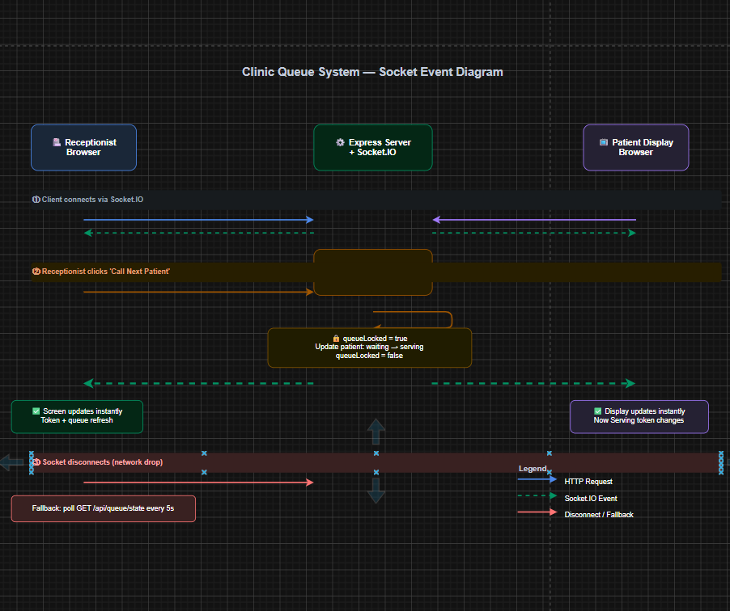

# CureQ — Real-Time Clinic Queue System

> Built for **Queue Cure '26** — Wooble Hackathon

A real-time clinic queue management system. The receptionist desk and the patient waiting room display stay perfectly in sync — no refresh, no delay, no shouting token numbers.

**Live Demo:** https://clinic-queue-management-ihd7.onrender.com

---

## Screenshots

| Receptionist Dashboard | Patient Display (TV Screen) |
|---|---|
| Register patients, call next token, manage session | Full-screen dark display with live token updates |

---

## Features

- **Receptionist View** — Register patients (auto token), call next, set consultation time, remove no-shows
- **Patient Display** — Large token number, waiting count, estimated wait time, live clock, ticker
- **Live sync** — Both screens update in under 100ms via Socket.IO when "Call Next" is clicked
- **Concurrency safe** — MongoDB distributed lock prevents double-calling race conditions
- **Offline resilience** — Falls back to polling every 5s if socket disconnects
- **Wait time from real data** — `position × consultation time`, never hardcoded
- **Custom modals** — No browser `window.confirm()` — polished confirmation dialogs throughout

---

## Tech Stack

| Layer | Technology |
|---|---|
| Frontend | React 19, Vite 6, Tailwind CSS 4 |
| Backend | Node.js (ESM), Express 4 |
| Real-time | Socket.IO 4 |
| Database | MongoDB Atlas (Mongoose 8) |
| Deployment | Render (single service) |

---

## Project Structure

```
Clinic-Queue-management/
├── client/                        # React frontend
│   └── src/
│       ├── pages/
│       │   ├── ReceptionistDashboard.jsx   # Sidebar layout, stats, queue management
│       │   └── PatientDisplay.jsx          # Full-screen dark TV display
│       ├── components/
│       │   ├── AddPatientForm.jsx          # Register patient, assign token
│       │   ├── QueueControls.jsx           # Call next, reset, consultation time
│       │   ├── WaitingQueueList.jsx        # Queue table with remove
│       │   ├── TokenDisplay.jsx            # Token number display
│       │   ├── ConfirmModal.jsx            # Custom confirmation dialog
│       │   └── LiveClock.jsx               # Real-time clock component
│       ├── hooks/
│       │   └── useSocket.js               # Socket.IO + polling fallback
│       └── api/
│           └── client.js                  # Fetch API wrapper
│
└── server/                        # Express backend
    └── src/
        ├── models/
        │   ├── Patient.js                 # tokenNumber, name, status, timestamps
        │   └── Settings.js                # consultationTime, lastToken, queueLock
        ├── routes/
        │   ├── patients.js                # POST /api/patients, DELETE /api/patients/:id
        │   ├── queue.js                   # GET /state, POST /next, POST /reset
        │   └── settings.js                # PUT /api/settings/consultation-time
        ├── services/
        │   └── queueService.js            # All queue logic + distributed lock
        ├── socket/
        │   └── index.js                   # Socket.IO setup + broadcastQueueState
        └── index.js                       # Server entry, serves React build in production
```

---

## Socket Event Diagram



```
Receptionist clicks "Call Next"
        │
        ▼
POST /api/queue/next  (HTTP)
        │
        ▼
MongoDB lock acquired ──► patient: waiting → serving ──► lock released
        │
        ▼
broadcastQueueState(io)
        │
        ├──► queue:state ──► Receptionist screen  (instant update)
        └──► queue:state ──► Patient display       (instant update)

New client connects:
  socket.on('connection') ──► socket.emit('queue:state', currentState)

Socket disconnects:
  Client polls GET /api/queue/state every 5 seconds
```

---

## Wait Time Formula

```
estimatedWaitMinutes = position × consultationTimeMinutes
```

- `position` — real-time index in the waiting queue from MongoDB
- `consultationTimeMinutes` — set by receptionist (default: 10 min)
- Recalculates automatically on every queue change
- Never hardcoded

---

## Concurrency & Edge Cases

| Scenario | Solution |
|---|---|
| Two receptionists click simultaneously | MongoDB atomic lock — only one wins, other retries |
| Server crash with lock stuck | Stale lock auto-cleared on every startup |
| Socket disconnect | Polling fallback every 5s — display never freezes |
| Multiple serving patients (orphan) | Detected, `queueHealth: degraded` warning shown |
| Token number collision | Unique DB index + atomic `$inc` inside lock + startup sync |
| Empty queue on call next | Graceful empty state, no crash |

---

## Running Locally

### Prerequisites
- Node.js v18+
- MongoDB Atlas account (free tier)

### 1. Clone & install
```bash
git clone https://github.com/palakagarwal19/Clinic-Queue-management.git
cd Clinic-Queue-management
npm run install:all
```

### 2. Environment variables

Create `server/.env`:
```
MONGODB_URI=mongodb+srv://<user>:<password>@<cluster>.mongodb.net/clinic-queue?retryWrites=true&w=majority
PORT=3001
CLIENT_URL=http://localhost:5173
```

Create `client/.env`:
```
VITE_API_URL=http://localhost:3001
VITE_SOCKET_URL=http://localhost:3001
```

### 3. Run

```bash
# Terminal 1 — backend
npm run dev:server

# Terminal 2 — frontend
npm run dev:client
```

Open:
- Receptionist: http://localhost:5173
- Patient Display: http://localhost:5173/display

---

## Deploying to Render

1. Push to GitHub
2. Create a **Web Service** on [render.com](https://render.com)
3. Set:
   - **Build Command:** `npm run build`
   - **Start Command:** `npm run start`
4. Add environment variables:
   - `MONGODB_URI` — your Atlas connection string
   - `NODE_ENV` — `production`
5. Deploy

The server serves the React build in production — single service, no separate static hosting needed.

---

## API Reference

| Method | Endpoint | Description |
|---|---|---|
| GET | `/api/health` | Server health check |
| GET | `/api/queue/state` | Full queue state |
| POST | `/api/queue/next` | Call next patient |
| POST | `/api/queue/reset` | Reset queue for new session |
| POST | `/api/patients` | Register patient, assign token |
| DELETE | `/api/patients/:id` | Remove patient (no-show) |
| PUT | `/api/settings/consultation-time` | Update avg consultation time |

---

## Submission — Queue Cure '26

- **Working prototype:** https://clinic-queue-management-ihd7.onrender.com
- **GitHub repo:** https://github.com/palakagarwal19/Clinic-Queue-management
- **Socket event diagram:** `socket-event-diagram.drawio` in repo root
- **Thought process:** Covers concurrency, distributed lock, offline fallback, wait time formula

---

Built by **Palak Agarwal** · Queue Cure '26 · Wooble
